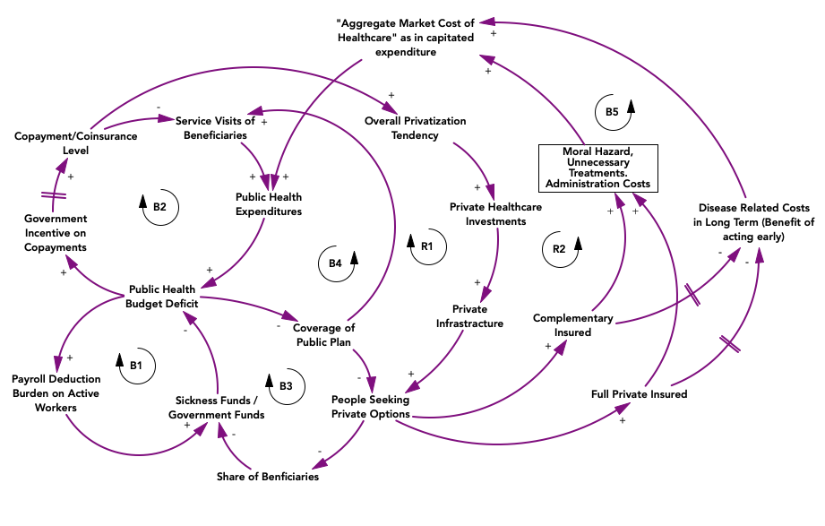

### Navigate back to [Main Page](https://sanserguz.github.io/main/)  
  
  _Thesis Progress Journal is currently under development._
 
**Thesis Advisors:** Assoc. Prof. Gönenç Yücel, Asst. Prof. Özge Karanfil   
**Thesis Description:** With the demographic factors of aging population and increased chronic disease prevalence , funding and provision of public healthcare systems are facing an alarming amount of pressure across the world. These factors not only contribute to the cost escalation trends in healthcare sector, but also causes less inflow to the sickness/government funds devoted to healthcare, since the share of the revenue generating portion of the population gradually decreases. The most direct consequences we have on the horizon are reductions in public coverages and increases in coinsurance levels. Having private supplementary insurances in the market, the extent of this modification bears the risks of privatization of healthcare systems or even a complete convergence to the private insurance model, fulfilling the prophecies on commodification of healthcare. Alternative modes of financing should be sought to prepare for demographic challenges, which may include allocation of public revenues for healthcare, labor immigration policies to promote incoming workers, or even a transformation of healthcare provision structure from curative to preventive & palliative care. 

In this thesis, I aim to conduct a dynamic simulation analysis to design and test effective policies to sustain the system financially while preserving the well-being of the population (in terms of health metrics, e.g., QALY). Considering the delays in health policy implementations and underlying causal relations in the system, and the crucial dynamic complexity arising from interaction of different kinds of stakeholders (people, insurers) within the system, I plan to develop a hybrid model of system dynamics and agent-based simulation methods.

